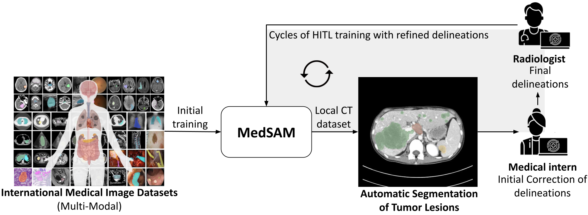
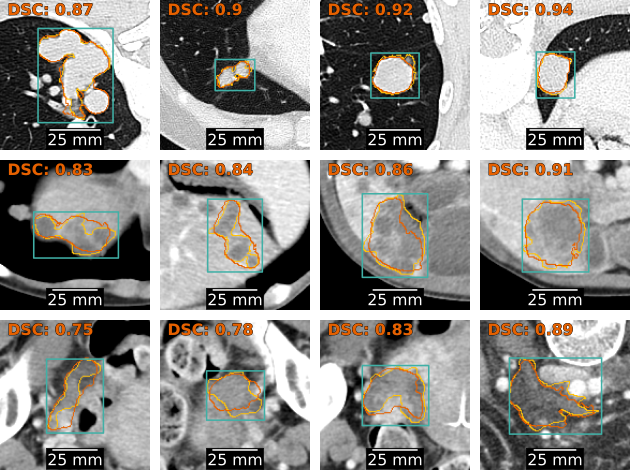

# Human-In-The-Loop: una estrategia para la Anotación Asistida de Tumores en imágenes de Tomografía Computarizada (TC)

Durante los últimos años, los modelos basados en Inteligencia Artificial han demostrado un gran potencial en el reconomicimiento de patrones para el análisis de imágenes médicas. Muchos de estos modelos han sido entrenados bajo la estrategia de *Aprendizaje Supervisado*, lo que significa ajustar el comportamiento del modelo en base a la muestra de ejemplos junto con el resultado esperado. Estos resultados esperados suelen conocerse con el nombre de *etiquetas*, y para el caso de Segmentación de Tumores, corresponde a la imagen o máscara que identifica las regiones de voxeles pertenecientes a cada tumor. Como anotar pixeles es demandante en términos de tiempo, **la anotación de ejemplos para resolver problemas de segmentación constituye un cuello de botella** en el desarrollo de modelos basados en IA bajo la estrategia de Aprendizaje Supervisado.

Con el objetivo de acelerar el proceso de anotación, se diseñó e implementó el proceso iterativo *Human-In-The-Loop*, caracterizado por tener:
- **Anotación Asistida** por un modelo de IA que funciona en base *prompts*, donde el anotador indica la ubicación del tumor.
- **Ciclos iterativos de anotación**, que permiten re-entrenar el modelo de IA para el siguiente ciclo de anotación.

<figure>
  
  <figcaption style="text-align: justify; max-width: 800px; margin: 0 auto;">
    <b>Ciclos Human-In-The-Loop (HITL) para la anotación asistida de imágenes de TC.</b> Se utiliza el modelo fundacional <a href="https://doi.org/10.1109/CAI54212.2023.00137">MedSAM</a> como asistente de inteligencia artificial para generar segmentaciones iniciales a partir de indicaciones de recuadros (bounding boxes) trazadas por médicos residentes en radiología. Las segmentaciones generadas por MedSAM son corregidas por los residentes y posteriormente refinadas por radiólogos. Las máscaras mejoradas se emplean para re-entrenar el modelo MedSAM antes de iniciar un nuevo ciclo HITL.
  </figcaption>
</figure>

# Implementación en 3D Slicer

<figure style="text-align: center;">
  <video src="assets/hitl_segmentation_assistant_3d_slicer.mp4" style="max-width: 100%; height: auto;" controls loop muted>
    Your browser does not support the video tag.
  </video>
  <figcaption style="text-align: justify; max-width: 800px; margin: 0 auto;">
    <b>Anotación Asistida por MedSAM en 3D Slicer</b>. MedSAM se integra como un plugin en el software 3D Slicer, permitiendo la descarga, visualización y anotación de tumores en imágenes de TC. Los residentes de radiología encierran en una caja 3D el tumor observado, y MedSAM genera una segmentación preliminar que luego es refinada manualmente utilizando las herrmientas de edición integradas en 3D Slicer.
  </figcaption>
</figure>

<figure>
  
  <figcaption style="text-align: justify; max-width: 800px; margin: 0 auto;">
    <b>Ejemplos de tumores anotados.</b> De izquierda a derecha, las columnas muestran: un corte coronal del CT, un corte axial del CT, y una visualización 3D de todos los tumores segmentados, donde cada color representa un tumor distinto. La fila superior (a–c) corresponde a un estudio de tórax, mientras que la fila inferior (d–f) muestra un CT de abdomen y pelvis.
  </figcaption>
</figure>

# Evolución del Desempeño con los ciclos HITL

<figure style="text-align: center;">
  <video src="assets/hitl_medsam_evolution.mp4" style="max-width: 100%; height: auto;" controls loop muted>
    Your browser does not support the video tag.
  </video>
  <figcaption style="text-align: justify; max-width: 800px; margin: 0 auto;">
    <b>Evolución del desempeño del Asistente de Anotación con los ciclos de anotación</b>. (a) Distribución de los coeficientes de Dice en función del tamaño de los tumores, obtenidos con el modelo MedSAM re-entrenado tras cada ciclo de anotación. Cada punto representa una caja delimitadora (bounding box) encerrando un tumor perteneciente al conjunto de test. El conjunto de test fue anotado de manera completamente manual, sin ayuda del Asistente de Anotación (b) Distribución de probabilidad del coeficiente de Dice después de cada ciclo de anotación, estimada mediante KDE con *kernels* gaussianos.
  </figcaption>
</figure>

<figure style="text-align: center;">
 
  <figcaption style="text-align: justify; max-width: 800px; margin: 0 auto;">
    <b>Comparación entre las segmentaciones predichas (naranja) y las anotadas por radiólogos (amarillo).</b> El modelo MedSAM ajustado recibe un corte del TC y un bounding box (cian) para generar una máscara de segmentación como salida. La similitud entre las segmentaciones predichas y las de los radiólogos se mide mediante el coficiente de Dice (DSC). De arriba hacia abajo se muestran tumores pulmonares, tumores hepáticos y adenopatías.
  </figcaption>
</figure>
